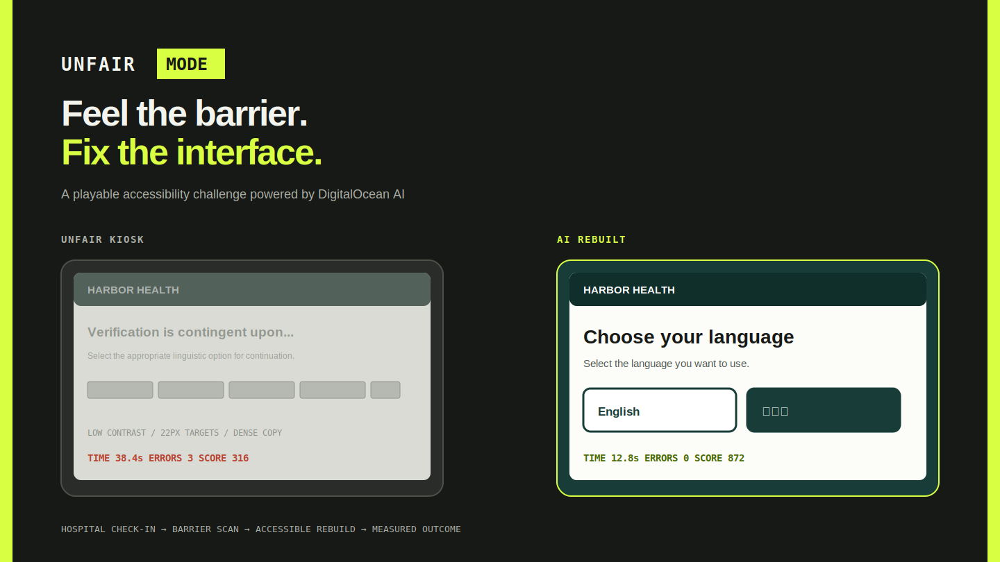

# UNFAIR MODE



**Feel the barrier. Fix the interface.**

UNFAIR MODE is a playable hospital kiosk accessibility challenge. Complete a patient check-in through an intentionally unfair interface, let DigitalOcean AI identify and repair its barriers, then replay the same mission and beat your score.

## Demo

1. Read Minseo Kim's patient brief.
2. Complete the unfair kiosk challenge in under 30 seconds. Wrong answers cost 100 points.
3. Select **Analyze interface** and review the structured barrier report.
4. Select **Rebuild accessibly** and replay the same mission.
5. Compare completion time, errors, and score before and after the rebuild.

## Why it matters

A service can technically be online and still be impossible to use. Low contrast, tiny targets, time pressure, and dense language can stand between a person and healthcare. UNFAIR MODE makes those product decisions visible and gives teams a practical first repair.

## How DigitalOcean AI is used

The kiosk sends a structured representation of the active screen and barriers to a server-side DigitalOcean AI endpoint. The model returns constrained JSON containing prioritized issues and actionable repairs. The app displays those decisions and maps the approved patch to accessible interface components.

The repository includes an OpenAI-compatible server adapter. Configure the exact endpoint and model supplied by the official DigitalOcean event guide:

```bash
export DO_AI_ENDPOINT='YOUR_OFFICIAL_ENDPOINT'
export DO_AI_API_KEY='YOUR_KEY'
export DO_AI_MODEL='YOUR_MODEL'
python3 server.py
```

When no live service is configured, the demo clearly labels and uses a saved analysis. It never presents fallback output as a live AI response.

## Run locally

No package installation is required.

```bash
python3 server.py
```

Open http://localhost:8000.

## Architecture

```text
Hospital kiosk schema
  -> /api/analyze
  -> DigitalOcean AI
  -> constrained issue JSON
  -> barrier report
  -> accessible component rebuild
  -> before/after task metrics
```

## Responsible design

UNFAIR MODE does not reproduce the lived experience of disability, certify WCAG or ADA compliance, or replace testing with disabled people and accessibility professionals. Its modes illustrate specific interface barriers and identify candidate improvements.

The prototype does not collect or transmit real patient information.

## Built during the hackathon

Created during the official hacking period for MLH and DigitalOcean's AI for Social Good hackathon.

## Tech

- HTML, CSS, JavaScript
- Python standard library server
- DigitalOcean AI compatible server integration

## License

MIT
